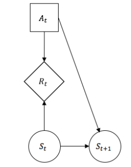

# Gambler's Problem

This repository contains code that solves the Gambler's Problem as described by Sutton and Barto (2017). In the first approach, the problem is tackled using dynamic programming, specifically employing the "value iteration" technique outlined by Kochenderfer (2015).

A second implementation solves the problem by searching directly within the space of possible policies. This search is conducted using Genetic Algorithms.

## Problem Description

The Gambler's Problem involves a scenario where a person starts with an initial amount of money, typically ranging from 1 to 100 units. At each turn, the person must decide how much of their current money to bet. The process continues until the person either reaches a goal of 100 units or loses all their money.

The objective is to find an optimal strategy that maximizes the person's gain over multiple rounds of betting.

# Gambler's Problem

This repository contains code that solves the Gambler's Problem as described by Sutton and Barto (2017). In the first approach, the problem is tackled using dynamic programming, specifically employing the "value iteration" technique outlined by Kochenderfer (2015).

A second implementation solves the problem by searching directly within the space of possible policies. This search is conducted using Genetic Algorithms.

## Problem Description

The Gambler's Problem involves a scenario where a person starts with an initial amount of money, typically ranging from 1 to 100 units. At each turn, the person must decide how much of their current money to bet. The process continues until the person either reaches a goal of 100 units or loses all their money.

The objective is to find an optimal strategy that maximizes the person's gain over multiple rounds of betting.

## Results

### 1. Process Visualization

  

Graph describing the process as a Markov Decision Process.

### 2. Optimal Strategy using Dynamic Programming

  

Graph illustrating the optimal strategy obtained using dynamic programming.

### 3. Optimal Strategy using Genetic Algorithms

  

Graph showing the optimal strategy obtained using Genetic Algorithms.

### 4. Comparison

  

Comparison between the two methods, highlighting their effectiveness in optimizing the gambler's gain over time.

## Detailed Implementation and Theoretical Details

For a more detailed implementation and theoretical insights, please refer to [my Master's thesis]([link_here](https://hdl.handle.net/20.500.14330/TES01000781267)).

## Acknowledgements

- Sutton, R. S., & Barto, A. G. (2017). Reinforcement learning: An introduction. MIT press.
- Kochenderfer, M. J. (2015). Decision making under uncertainty: Theory and application. MIT press.

Feel free to explore, experiment, and contribute improvements to this repository!
